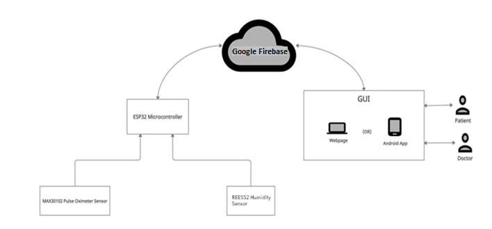

# Health-monitoring-system-using-IoT
Bachelors capstone project carried out at VIT Chennai

## About

The proposed model/system aims to monitor the health of people by observing the change in the respiratory system, heart rate, and blood oxygen level and alert the user to take precautions. This model monitors the breathing/respiration rate, Blood oxygen level, and beats per minute (Bpm) of the patients all through the day in their daily life to notify the user in case there is any discrepancy is observed.

## Schematic Diagram of the Proposed System

## Folder structure

### scripts
The main script for setting up ESP32 can be found in `scripts/hw_runner.py`

### docs
A few documents prepared over the course of the project

## App

Refer [this repository](https://github.com/manu22may/DrMask) for viewing the Kotlin script of the app developed as a part of this project.